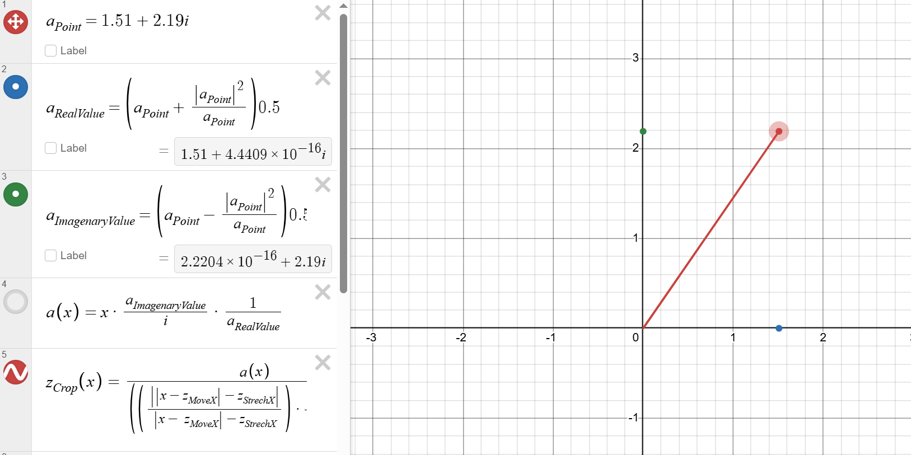
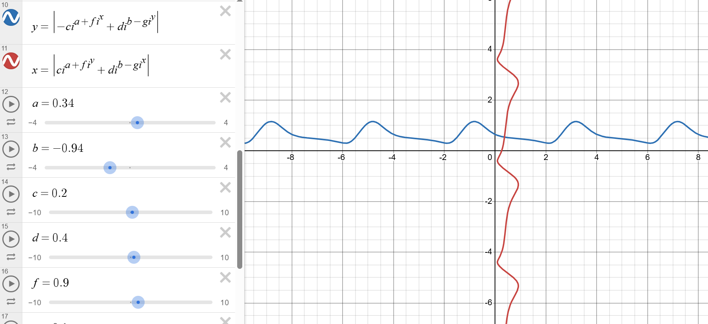
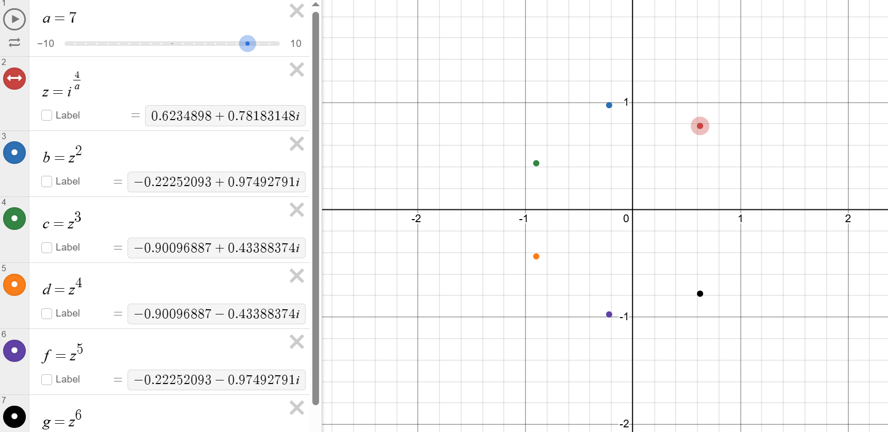
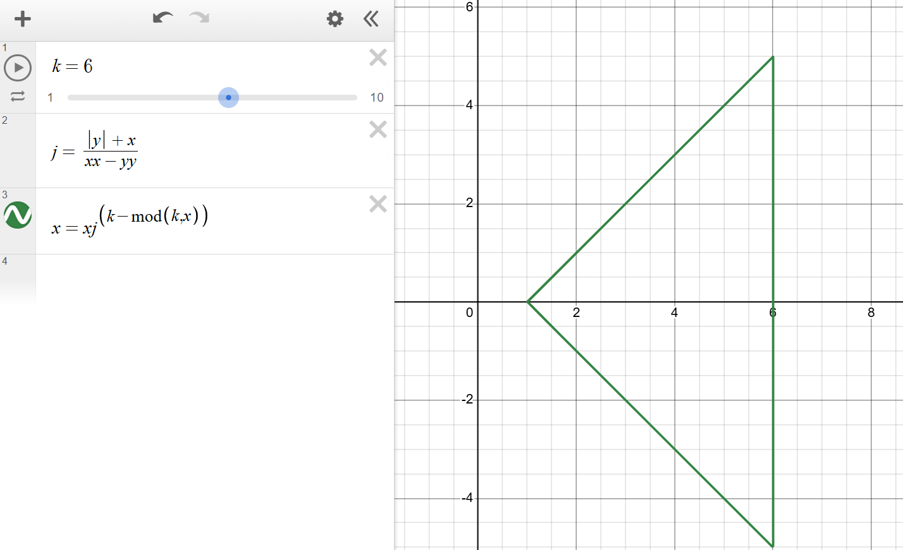
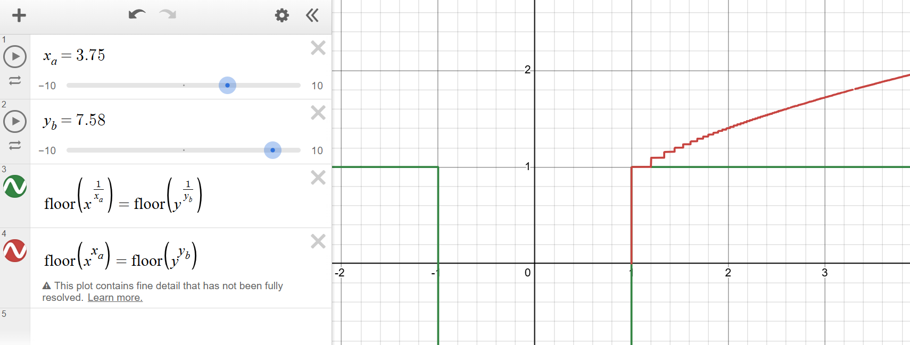
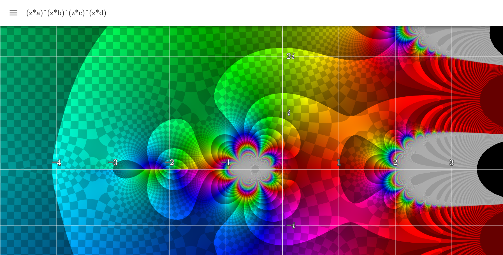
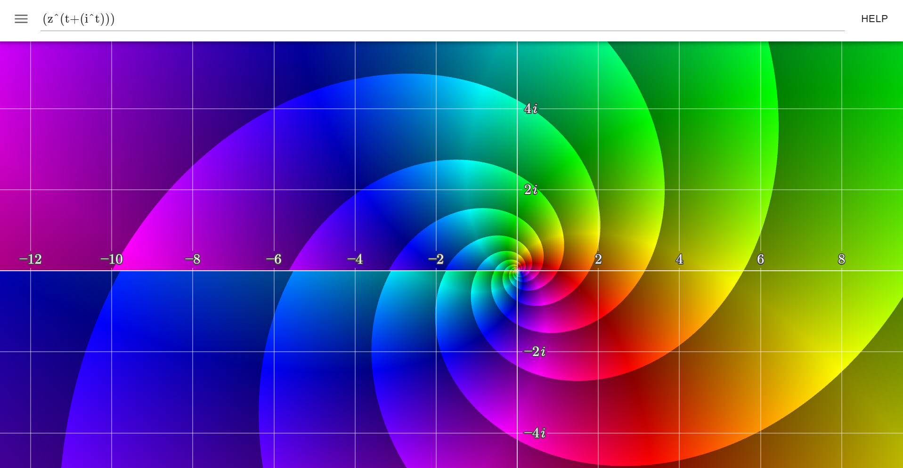

# My-Desmos-graphs

This is just a list of cool math graps and funtions I made in Desmos.  
As I know, there is no easy way to share your Desmos graphs.

Here I had a complex number and made it like a 2D vector in pure algebra: https://www.desmos.com/calculator/rjedz1lmme  

In this one I explored power of i: https://www.desmos.com/calculator/g39z2eivka  

I used a simpel rule with complex numbers to get symetric shapes: https://www.desmos.com/calculator/1lypnjsqiu  

A flexebel triangel: https://www.desmos.com/calculator/lostjdy1dx  

I explored the floor function with powers: https://www.desmos.com/calculator/cfjucbvymh  

---

## Here are som extras

These are not made in Desmos, but are still cool. Press the 3 lines on the top to edit the variables.  
The lighter the colors are, the bigger the function value is and the darker, the smaller the function value.  
Z is an complex number for the function input and any other letter is just an variable.  
**When you click one of the links, the variables are going to be betwen 0 and 1, I hade them originaly betwen -4 and 4.**

Exponents of Z: https://samuelj.li/complex-function-plotter/#(z*a)%5E(z*b)%5E(z*c)%5E(z*d)  

Z with a complex exponent: [https://samuelj.li/complex-function-plotter/#(z%5E(t%2B(i%5Et)))](https://samuelj.li/complex-function-plotter/#(z%5E(t%2B(i%5Et))))  

